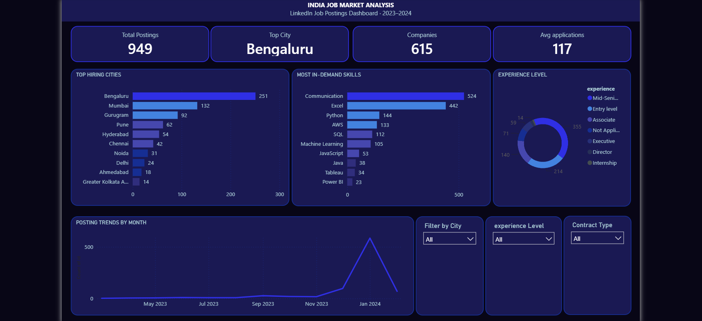

# India Job Market Analysis (SQL)

SQL-based analysis of 949 LinkedIn job postings from the Indian job market — covering data cleaning, business-question analysis, insights, and a Power BI dashboard.

## Tools used
- MySQL (data cleaning + analysis)
- Power BI (dashboard)

## Folder structure
- `data/raw/` — original LinkedIn jobs CSV
- `sql/` — full pipeline: schema, import, audit, cleaning, business questions
- `dashboard/` — Power BI .pbix file and dashboard screenshot
- `insights.md` — full write-up of findings, caveats, and limitations

## Key findings
- Bengaluru leads hiring with 27% of all postings (251 of 919)
- Communication and Excel dominate skill mentions; Python leads technical skills
- Mid-Senior level roles account for 41% of postings
- January 2024 spike in postings reflects data collection timing, not a real surge
- Communication is the top skill in 7 of 8 major cities — Chennai is the exception (Excel)

## Dashboard preview

